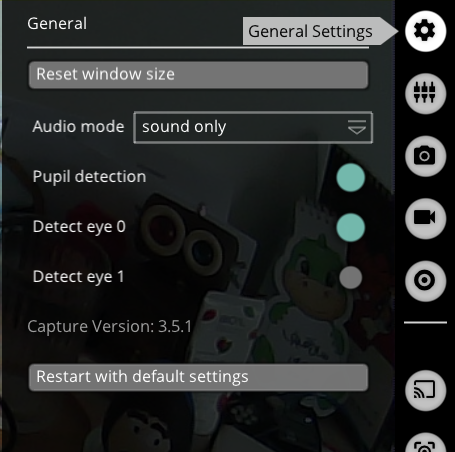
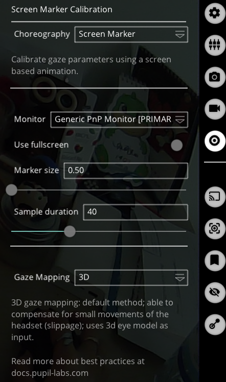

# Gaze-Tracker
Control A Robotic Hand using Gaze Tracker headset

-- mention what gaze tracker is being used and what is the output

<br>

## Content
### Gaze Tracker 
+ [Headset SetUp](#headset-setup)
    + [Headset Cameras Adjustment](#adjust-the-headset-cameras)
    + [Start Calibration](#start-calibrating)
+ [Recieve Data](#recieve-data)
    + [Pupil Remote - Record Data](#pupil-remote---record-data)
        + [Export Data from Recordings](#export-data-from-recordings)
    + [IPC Backbone - Real-Time Data](#ipc-backbone---real-time-data)


<br>

## Headset Setup
A few steps should be taken to get ready for using data.
> Install **Pupil Core Bundles** software from [here](https://docs.pupil-labs.com/core/getting-started/)

### Adjust the Headset Cameras
First, adjust the cameras to get the most accurate result from caliberation.
>
> + Adjust the Eye Camera \
> Use **`Pupil Service`** Software.
>    + Adjust the camera to have your pupile visible in all angles, even the very extreme ones.
>   + Turning your head while staring at a certain point on the screen, makes it easier to addjust the camera.
>   + **Dark Blue circle around your eyeball** : means the camera is well adjusted and is fit to the eyeball.
>   + **Light Blue circle around your eyeball** : means the eyemodel is not well-fitted.
>   + **Red Dot on Pupil** : means that your pupil is detectable in that angle. Adjust the camera in a way to have this ***red dot*** always on your pupil while you are looking at a point with different angles.
> > 
> + Adjust the World Camera\
> Use **`Pupil Capture`** software.
>   + Turn the camera to have almost the same scene as you see in front of you without bending your head.

Now, it's time to caliberate the headset to understands at which object you are looking.

### Start Calibrating
> Make sure at least one of the eye cameras are chosen for the caliberation.



<br>

> There are **three** modes for calibrating the headset, can be chosen from *`Choreolography`* dropdown menue:
>   + **Screen Marker** : The easiest way of calibration. Some markers will appear on the screen and you need to look at them without moving your head until they get disappear.\
***KEEP THAT IN MIND DO NOT MOVE AT ALL.***
>   + **Single Marker** : is Used when you want to calibrate the headset using physical markers.
>   + **Natural Feature** : You define where you are looking at by clicking and selecting the area of scene on the screen. 
>
> By clicking on `C` Botton on the screen or from keyboard, calibration process gets started.




> ***Notes for calibration***
> + If the screen keeps blinking, you may need to turn off the *`Use fullscreen`* mode, and maximize the window quickly. 
> + Decreasing the *Marker Size* results in a more precise caliberation.
> + Also, **2D** *`Gaze Mapping`* gives the best accuracy, yet it is very sensitive to slippage.   
[More Information](https://docs.pupil-labs.com/core/best-practices/#choose-the-right-gaze-mapping-pipeline)

Once the calibration is finished, a pink circle apears on the screen which shows at where you are looking.
Then, evaluate the calibration by looking at different objects to see how accurate it works. If not accurate enough, start calibrating over again. 

***Note***: You might need to recalibrate the headset multiple times. So, after finishing calibration, evalute the accuracy. 

***Note*** : Each time that you reopen the **`Pupile Capture`** software, you need to caliberate the headset again. Even if you haven't changed your or cameras' positions.

> **Make sure to ckeck for more information for [Getting Started](https://docs.pupil-labs.com/core/software/pupil-capture/) and [Calibration Best Practice](https://docs.pupil-labs.com/core/best-practices/#synchronization)**

## Recieve Data 
There are multiple ways to recieve data from gaze tracker. Here, `Netwrok API` is used and discussed. Using this API, data can be sent and recieved from the Pupil Core software and gaze, fixation and video data can be accessed.

> There are two different ways that you can interact with the Pupil Core Network API:
> + **Pupil Remote**: Simple text-based API to remote control Pupil Core software.
> + **IPC Backbone**: msgpack based API with access to realtime data.

### Pupil Remote - Record data
The `zmq` package should be installed.

```shell
$ pip install zmq msgpack==0.5.6
```
For recording data from Pupile core remotely, after connting to the software through *`Socket`* communication, `'R'` comammand should be sent.
```py
pupil_remote.send_string('R')
print(pupil_remote.recv_string())

sleep(5) ### Reacord Data for 5 Sec

pupil_remote.send_string('r')
print(pupil_remote.recv_string())
```
> Full Script can be found [here.](./src/gaze_tracker/pupile_remote.py)

Variables can be used in `Pupil Remote`:
```py
'R'  # start recording with auto generated session name
'R rec_name'  # start recording named "rec_name"
'r'  # stop recording
'C'  # start currently selected calibration
'c'  # stop currently selected calibration
'T 1234.56'  # resets current Pupil time to given timestamp
't'  # get current Pupil time; returns a float as string.
'v'  # get the Pupil Core software version string

# IPC Backbone communication
'PUB_PORT'  # return the current pub port of the IPC Backbone
'SUB_PORT'  # return the current sub port of the IPC Backbone
```
#### Export data from recordings
> Recorded data can be found in a folder in your main `user` directory named ***`recordings`***.

Upload the folder containing recordings into ***`Pupil Player`*** and press ***`E`*** on your keyboard to download the data. The exported files can be found in the same directory, under `exports`.
> In exports folder you can find:
> + 4 *csv* files 
>   + Export Information
>   + `Gaze Positions` - *This is what we look for*
>   + Pupil Positions
>   + World Timestamps
> + a information text-file : Explains what each variable refer to
> + a recorded video of World with your gaze moving around.

More information can be found [here](https://docs.pupil-labs.com/core/getting-started/#_5-start-recording) and [here.](https://docs.pupil-labs.com/core/developer/network-api/#pupil-remote)
<br>

### IPC Backbone - Real-Time Data
Using `IPC Backbone` gives access to the data from Pupil capture and Service, realtime. \
It uses ZeroMQ's `PUB-SUB`(Publisher-Subscriber) pattern for one-to-many communication. Note that when you use a SUB socket you must set a subscription using zmq_setsockopt() and SUBSCRIBE, as in this code. [More Info](https://zguide.zeromq.org/docs/chapter1/#Getting-the-Message-Out)

For IPC Backbone both the IP address and the session's unique port are needed:

```py
import zmq
ctx = zmq.Context()
# The REQ talks to Pupil remote and receives the session unique IPC SUB PORT
pupil_remote = ctx.socket(zmq.REQ)

ip = 'localhost'  # If you talk to a different machine use its IP.
port = 50020  # The port defaults to 50020. Set in Pupil Capture GUI.

pupil_remote.connect(f'tcp://{ip}:{port}')

# Request 'SUB_PORT' for reading data
pupil_remote.send_string('SUB_PORT')
sub_port = pupil_remote.recv_string()

# Request 'PUB_PORT' for writing data
pupil_remote.send_string('PUB_PORT')
pub_port = pupil_remote.recv_string()
```

Now, for reading data, the `desired data` should be `subscribed` to  `topic`. Here, we only care about `gaze` data. Therefore, the rest of th code would be as bellow:

```py
while True:
    subscriber = ctx.socket(zmq.SUB)
    subscriber.connect(f'tcp://{ip}:{sub_port}')
    subscriber.subscribe('gaze.')  # receive all gaze messages

    topic, payload = subscriber.recv_multipart()
    message = msgpack.loads(payload)
    
    print(f"{topic}: {message}") ### The whole data
```

Export only the gazed point's coodinates:
```py
### Coordinates of the point that is being looked at:
print(message[b'gaze_point_3d'])
```
> ***Note*** : ***`Pupile Capture`*** should be kept open while data is being read.

More information about [IPC Backbone](https://docs.pupil-labs.com/core/developer/network-api/#ipc-backbone) and [data format](https://docs.pupil-labs.com/core/developer/#pupil-datum-format)