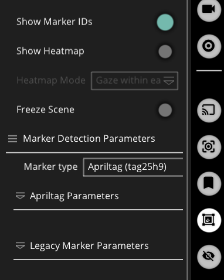
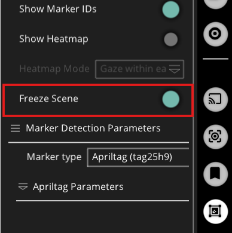
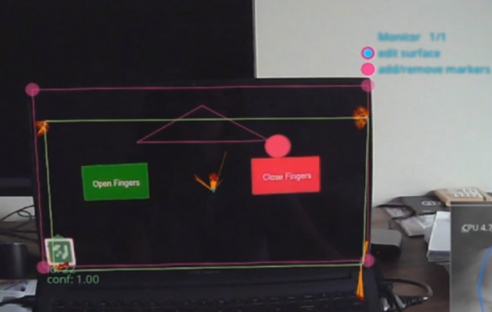
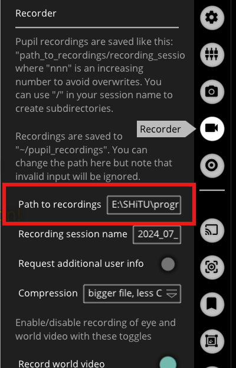
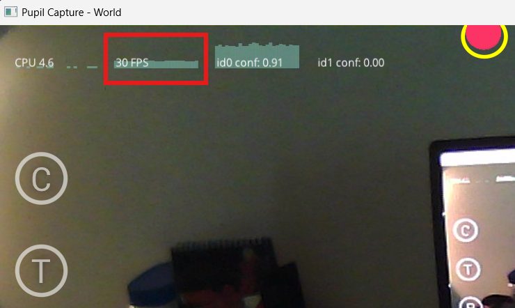
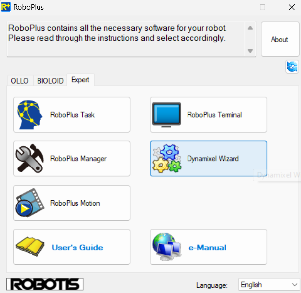
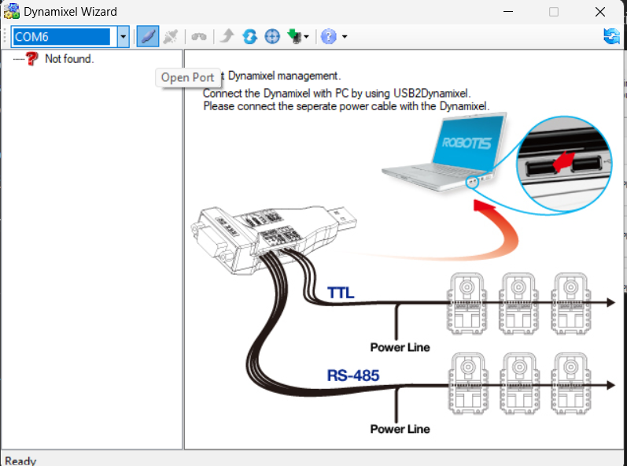
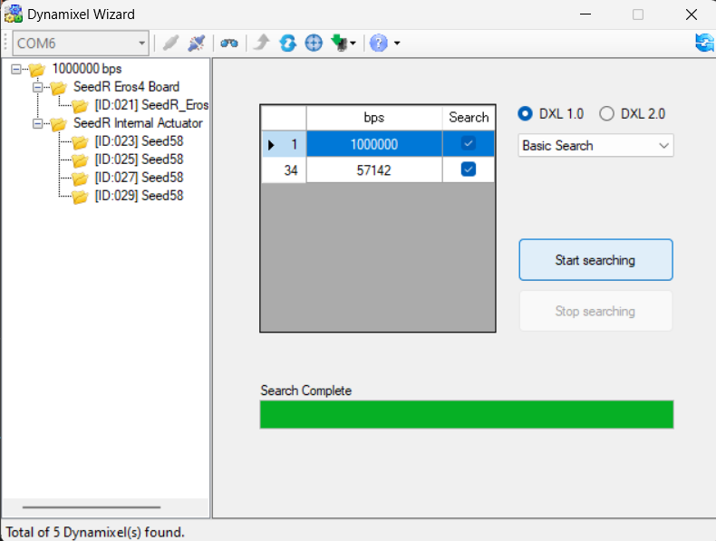
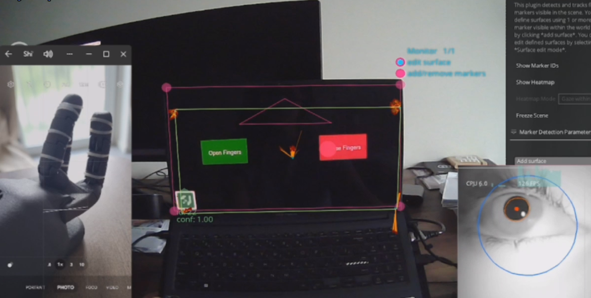
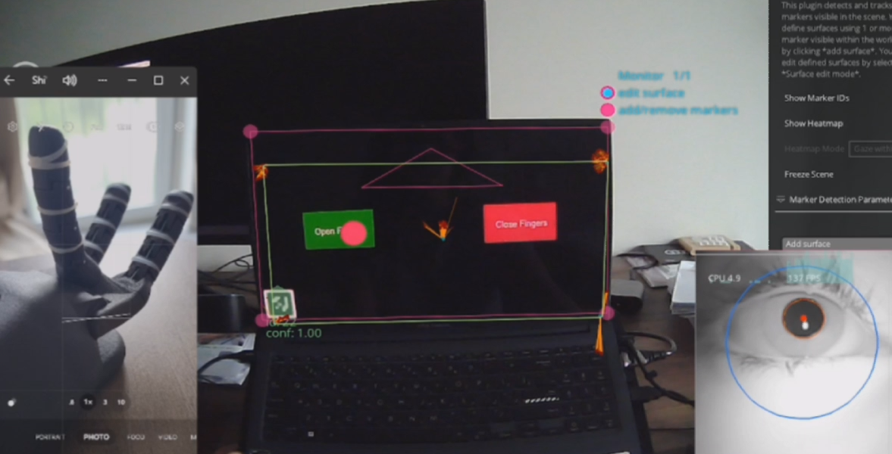

# Gaze-Tracker
Control A Robotic Hand using Gaze Tracker headset

-- mention what gaze tracker is being used and what is the output

<br>

## Content
### [Gaze Tracker](#gaze-tracker-headset) 
+ [Headset SetUp](#headset-setup)
    + [Headset Cameras Adjustment](#adjust-the-headset-cameras)
    + [Start Calibration](#start-calibrating)
+ [Recieve Data](#recieve-data)
    + [**Pupil Remote - Record Data**](#pupil-remote---record-data)
        + [Export Data from Recordings](#export-data-from-recordings)
    + [**IPC Backbone - Real-Time Data**](#ipc-backbone---real-time-data)
      + [`Gaze data - Python Code`](#gaze-data---python)
      + [Gaze data on a 2D surface](#gaze-data-on-a-surface)
        + [Define a surface](#defining-the-surface-using-apriltag-marker)
        + [`Gaze data on surface - Python Code`](#gaze-coordinates-on-surface---python)
      + [`Gaze Tracker Class - Python Code`](#gaze-tracker-class)
    + [**Take image from World Camera**](#take-an-image-from-world-camera)
      + [`Capture_World Class - Python Code`](#capture_world-class)
        

### [Robotic Hand](#robotic-hand-1)
+ [Move robotic hand via RoboPlus](#move-the-robotic-hand-via-roboplus)
+ [`Control the movement - Python`](#control-the-hand-using-pypot)
+ [`Robotic Hand Control - Class`](#modules-from-robotic_hand_controlclass)
    + [Class Modules](#modules-from-robotic_hand_controlclass)
    + [Motor Names](#motor_name)

### [Projects](#projects)
+ [Control Robotic Hand by gazing at a menu](#control-robotic-hand-by-gazing-at-a-menu)
  + [menu class](#menu)


<br>

# Gaze Tracker Headset

## Headset Setup
A few steps should be taken to get ready for using data.
> Install **Pupil Core Bundles** software from [here](https://docs.pupil-labs.com/core/getting-started/)

### Adjust the Headset Cameras
First, adjust the cameras to get the most accurate result from caliberation.
>
> + Adjust the Eye Camera \
> Use **`Pupil Service`** Software.
>    + Adjust the camera to have your pupile visible in all angles, even the very extreme ones.
>   + Turning your head while staring at a certain point on the screen, makes it easier to addjust the camera.
>   + **Dark Blue circle around your eyeball** : means the camera is well adjusted and is fit to the eyeball.
>   + **Light Blue circle around your eyeball** : means the eyemodel is not well-fitted.
>   + **Red Dot on Pupil** : means that your pupil is detectable in that angle. Adjust the camera in a way to have this ***red dot*** always on your pupil while you are looking at a point with different angles.
> > 
> + Adjust the World Camera\
> Use **`Pupil Capture`** software.
>   + Turn the camera to have almost the same scene as you see in front of you without bending your head.

Now, it's time to caliberate the headset to understands at which object you are looking.

### Start Calibrating
> Make sure at least one of the eye cameras are chosen for the caliberation.


<br>

> There are **three** modes for calibrating the headset, can be chosen from *`Choreolography`* dropdown menue:
>   + **Screen Marker** : The easiest way of calibration. Some markers will appear on the screen and you need to look at them without moving your head until they get disappear.\
***KEEP THAT IN MIND DO NOT MOVE AT ALL.***
>   + **Single Marker** : is Used when you want to calibrate the headset using physical markers.
>   + **Natural Feature** : You define where you are looking at by clicking and selecting the area of scene on the screen. 
>
> By clicking on `C` Botton on the screen or from keyboard, calibration process gets started.


> ***Notes for calibration***
> + If the screen keeps blinking, you may need to turn off the *`Use fullscreen`* mode, and maximize the window quickly. 
> + Decreasing the *Marker Size* results in a more precise caliberation.
> + Also, **2D** *`Gaze Mapping`* gives the best accuracy, yet it is very sensitive to slippage.   
[More Information](https://docs.pupil-labs.com/core/best-practices/#choose-the-right-gaze-mapping-pipeline)

Once the calibration is finished, a pink circle apears on the screen which shows at where you are looking.
Then, evaluate the calibration by looking at different objects to see how accurate it works. If not accurate enough, start calibrating over again. 

***Note***: You might need to recalibrate the headset multiple times. So, after finishing calibration, evalute the accuracy. 

***Note*** : Each time that you reopen the **`Pupile Capture`** software, you need to caliberate the headset again. Even if you haven't changed your or cameras' positions.

> **Make sure to ckeck for more information for [Getting Started](https://docs.pupil-labs.com/core/software/pupil-capture/) and [Calibration Best Practice](https://docs.pupil-labs.com/core/best-practices/#synchronization)**

## Recieve Data 
There are multiple ways to recieve data from gaze tracker. Here, `Netwrok API` is used and discussed. Using this API, data can be sent and recieved from the Pupil Core software and gaze, fixation and video data can be accessed.

> There are two different ways that you can interact with the Pupil Core Network API:
> + **Pupil Remote**: Simple text-based API to remote control Pupil Core software.
> + **IPC Backbone**: msgpack based API with access to realtime data.

### Pupil Remote - Record data
The `zmq` package should be installed.

```shell
$ pip install zmq msgpack==0.5.6
```
For recording data from Pupile core remotely, after connting to the software through *`Socket`* communication, `'R'` comammand should be sent.
```py
pupil_remote.send_string('R')
print(pupil_remote.recv_string())

sleep(5) ### Reacord Data for 5 Sec

pupil_remote.send_string('r')
print(pupil_remote.recv_string())
```
> Full Script can be found [here.](./src/gaze_tracker/pupile_remote.py)

Variables can be used in `Pupil Remote`:
```py
'R'  # start recording with auto generated session name
'R rec_name'  # start recording named "rec_name"
'r'  # stop recording
'C'  # start currently selected calibration
'c'  # stop currently selected calibration
'T 1234.56'  # resets current Pupil time to given timestamp
't'  # get current Pupil time; returns a float as string.
'v'  # get the Pupil Core software version string

# IPC Backbone communication
'PUB_PORT'  # return the current pub port of the IPC Backbone
'SUB_PORT'  # return the current sub port of the IPC Backbone
```
#### Export data from recordings
> Recorded data can be found in a folder in your main `user` directory named ***`recordings`***.

Upload the folder containing recordings into ***`Pupil Player`*** and press ***`E`*** on your keyboard to download the data. The exported files can be found in the same directory, under `exports`.
> In exports folder you can find:
> + 4 *csv* files 
>   + Export Information
>   + `Gaze Positions` - *This is what we look for*
>   + Pupil Positions
>   + World Timestamps
> + a information text-file : Explains what each variable refer to
> + a recorded video of World with your gaze moving around.

More information can be found [here](https://docs.pupil-labs.com/core/getting-started/#_5-start-recording) and [here.](https://docs.pupil-labs.com/core/developer/network-api/#pupil-remote)
<br>

### IPC Backbone - Real-Time Data
Using `IPC Backbone` gives access to the data from Pupil capture and Service, realtime. \
It uses ZeroMQ's `PUB-SUB`(Publisher-Subscriber) pattern for one-to-many communication. Note that when you use a SUB socket you must set a subscription using zmq_setsockopt() and SUBSCRIBE, as in this code. [More Info](https://zguide.zeromq.org/docs/chapter1/#Getting-the-Message-Out)

### Gaze data - Python
[***gaze data Python Script***](./src/gaze_tracker/pupil_backbone.py)

For IPC Backbone both the IP address and the session's unique port are needed:

```py
import zmq
ctx = zmq.Context()
# The REQ talks to Pupil remote and receives the session unique IPC SUB PORT
pupil_remote = ctx.socket(zmq.REQ)

ip = 'localhost'  # If you talk to a different machine use its IP.
port = 50020  # The port defaults to 50020. Set in Pupil Capture GUI.

pupil_remote.connect(f'tcp://{ip}:{port}')

# Request 'SUB_PORT' for reading data
pupil_remote.send_string('SUB_PORT')
sub_port = pupil_remote.recv_string()

# Request 'PUB_PORT' for writing data
pupil_remote.send_string('PUB_PORT')
pub_port = pupil_remote.recv_string()
```

Now, for reading data, the `desired data` should be `subscribed` to  `topic`. Here, we only care about `gaze` data. Therefore, the rest of th code would be as bellow:

```py
while True:
    subscriber = ctx.socket(zmq.SUB)
    subscriber.connect(f'tcp://{ip}:{sub_port}')
    subscriber.subscribe('gaze.')  # receive all gaze messages

    topic, payload = subscriber.recv_multipart()
    message = msgpack.loads(payload)
    
    print(f"{topic}: {message}") ### The whole data
```

Export only the gazed point's coodinates:
> ***NOTE*** *The value for gaze pose would be approximately from -250 to 250 in x direction*
```py
### Coordinates of the point that is being looked at:
print(message[b'gaze_point_3d'])
```
> ***Note*** : ***`Pupile Capture`*** should be kept open while data is being read.

More information about [IPC Backbone](https://docs.pupil-labs.com/core/developer/network-api/#ipc-backbone) and [data format](https://docs.pupil-labs.com/core/developer/#pupil-datum-format)


## Gaze Data on a Surface
By definig a 2D surface, like a monitor or a paper, only data withing that surface will be given.

> To define a surface, at least one `AprilTag` is needed. These tags can be recognized automatically by the gaze tracker headset.

### Apriltag
There are about 7 families of Apriltags that can be recognized by headset. Note to change the name of the tag you are using in the `Pupil software`, under `Marker Detection Parameters` menu, too.



<br>

> ***The Apriltag marker used in this project:***\
> Although it is blured, the gaze tracker headset could recognize it very easily.


### Defining the surface using [Apriltag marker](#apriltag)
1. The person wearing the headset should be positions in front of the surface.
    >***Note*** if you look at the surface from the side, it may not work very good, as a 2D surface is being defined not a 3D.
2. Once the Apriltag is detected by headset, press `add surface` button in `Pupil software`.

3. Then, `freeze the scene` to define the surface more easily.\
***Otherwise, as your head will have small movements, the corners of the surface will move constantly.***
    

4. Define the entire screen by `editing the surface`. 
    + There will be two buttons on top left of the apriltag on the screen. One of them is `edit surface`.  
    + drag each corner and define your desired surface.
    

Now the surface is defined and its data can be used via API.\
`norm pose` of `gaze on surface` data is being used here. This gives a value from `0 to 1` corresponding to the gaze location inside the defined surface.

> ***NOTE KEEP THE SCREEN FROZE*** *WHILE YOU ARE USING ITS DATA.* Otherwise it deos not give corecct values for the gaze. 
>
> ***NOTE*** Try to keep the head position as when you froze the screen to have the most accurate data.

Motre information about [Surface tracking](https://docs.pupil-labs.com/core/software/pupil-capture/#surface-tracking)


### Gaze Coordinates on Surface - Python
Same as recieving gaze data using API discussed [here](#ipc-backbone---real-time-data), data for `surface` can be obtained through a request. \
***Note*** to have a surface defined in `Pupil Software` first.

[***Gaze Data on Surface Python Script***](./src/gaze_tracker/gaze_on_surface.py)

```py
  while True:
    subscriber = ctx.socket(zmq.SUB)
    subscriber.connect(f'tcp://{ip}:{sub_port}')
    subscriber.subscribe('surfaces.')  

    topic, payload = subscriber.recv_multipart()
    message = msgpack.loads(payload)
    
    print(f"{topic}: {message}") ### The whole data
    ### Coordinates of the point that is being looked at:
    print(message[b'gaze_on_surfaces'][0][b'norm_pos']) ### Valur between 0 - 1

```
> ***NOTE*** *Norm Values will be as bellow:*\
> + **X direction**: `Left side` : `0` , `Right side` : `1`
> + **Y direction**: `Top` : `1` , `Bottom` : 0

## Gaze Tracker Class
This class contains both gaze data on `World` and on `specific surface`.

[***Gaze Tracker Class Python script***](./src/gaze_tracker/gaze_tracker.py)

```py
  from gaze_tracker.gaze_tracker import gaze_data

  gaze_data = gaze_data()
```
***Note*** If you are using this class in another directory, you need to give a relative path to have access to the Class. 

#### Gaze data
+ ***Gaze_Coordinate( )*** : Gives the `[x, y, z]` position of a point that is looked at in `World` environment. 
  ```py
    gaze_pose = gaze_data.gaze_coordinate()
    print(f"gaze: {gaze_pose}")
  ```
+ ***gaze_coordinate_on_surface( )*** : Gives normalized pose of the gaze. `[x, y]` position of the point in the defined surface.  
  ```py
    surface_data = gaze_data.gaze_coordinate_on_surface()
    print(f"surface: {surface_data}")
  ``` 


## Take an image from World Camera
A class has been written to make the use of the world camera easier.\
> I was not able to open the `World camera` of the gaze tracker headset using OpenCV. Therefore, I needed to record a video using [remote recording](#pupil-remote---record-data) then save a frame of it.

[***Main Python Script***](./src/gaze_tracker/world_view.py)

> ***NOTE NOTE*** \
>**You need to change the directory for saving recordings in `Pupil Core software`.**
```py
  ## default path for saving recordings => C:\Users\ASUS\recordings
  ## changed the path to this => ABSOLUTE\PATH\TO\Gaze-Tracker\src\gaze_tracker\world_camera_capture\world_video_capture
```
\

> ***NOTE NOTE***
> If you want to run the `world_view.py` script you need to change the path for importing `gaze data` as bellow, otherwise it will rise an error:

```py
  ### For running the world_view.py script itself, the import `gaze_data` should be az bellow:
  from gaze_tracker import gaze_data 
```

### `Capture_world` class

You need to define the `fps` (frame per second) of the world camera from `Pupil Core Software` if it is **not** `30 fps`. 



```py
  ### worldCamera_Fps is set in Pupil Core software
  world = capture_world(worldCamera_Fps=30)
```

### Modules of `Capture_world` 

+  ***Capture(Length_of_video)***
    + This function will record a `Length_of_video` long video from Wrold camera. 
    + And, gets the `gaze position` in the middle of the recording. (Length_of_video/2)   
    + No return value

+ ***gaze_pose_onWorld()***
    + This will return the `gaze position` obtained in between recording the video from world camera.

+ ***save_frame()***
    + This module saves the `middle frame` of World from the captured video
    + Returns the saved frame `absolute path`

<br>

# Robotic Hand
RH4D Advanced Manipulator is the robotic hand that is being used for this project.

## Move the robotic hand via RoboPlus
First, it is better to start with ***`Roboplus`*** software to get familiar with it.

> `RoboPlus` can be found [here](https://robotis.co.uk/software/roboplus-1-0.html) or directly downloaded from [here.](http://en.robotis.com/service/download.php?no=14)

1. Run the program and go to `Epert > Dynamixel Wizard`.




2. Choose right port and get connected to the robotic hand.



3. Search the port to find motors.



> ***Note***: If you do not have `1000000 bps` in your search table you might need some configuration. Follow the steps in [here](https://kb.seedrobotics.com/doku.php?id=dynamixel:dynwzrd_ctrltables) \
> ***Note***: You may find the montioned file in the ***`Conf`*** directory in the given path.

4. By choosing one of the motors named as `[ID:29]Seed58`, coresponded motor can be manipulated. 


## Control the Hand using Pypot
> `pypot` package is needed to be installed.
```shell
$ pip install pypot
```

[***Hand Conrtol Python Script***](./src/robotic_hand/control.py)

> To find motor ids, the port that hand is connected to, should get scanned. So, first we need to find the correct port.

```py
ports = pypot.dynamixel.get_available_ports()
print('available ports:', ports)

if not ports:
    raise IOError('No port available.')

port = ports[-1] ### COM6 : The port that hand is connetd to
dxl_io = pypot.dynamixel.DxlIO(port)
```
> For increasing the speed of the program, only a range, which contains motor Ids from , is scanned.

```py
motor_IDs = dxl_io.scan(range(10, 35))
```

> For writting an angle to the hand, a dictionary contaning `motor ids` and `positions` is needed.

```py
motor_pose = {}
for motor in motor_IDs:
    motor_pose[motor] = 0 ### setting the default value for motor positions
```

> By passing the desired angle to the dictionary, and to the hand, we can witness a smooth movement.\
> To make it more understandable, an `Enum` is used to specify each motor ID is connected to which part of the hand. 
```py
class Motor(Enum):
    wrist_R = 23 ### Wrist rotary movement
    wrist_BF = 25 ### Wrist back forth movement
    thumb = 27
    fingers = 29

### Setting thumb position to 90
motor_pose[Motor.thumb.value] = 90
dxl_io.set_goal_position(motor_pose)
```


More information can be found [here](https://poppy-project.github.io/pypot/dynamixel.html) and [here](https://docs.poppy-project.org/en/software-libraries/pypot)

## Robotic Hand Control Class
This class helps to move the robotic hand more easily.
Here is some explanation of its modules.
<br>

[***Robot hand Control Class***](./src/robotic_hand/control.py)

Once the motorIDs are found from [RoboPlus software](#move-the-robotic-hand-via-roboplus), define a range that includes all motors' ids.
> Here, the motors I used have IDs from 21 to 29. Therefore, I defined a range from 10 to 35.

***This range increases the speed of scanning the port for finding motor IDs in the code.***

```py
    from robotic_hand_controlClass import *

    motorID_scanningRange = [10, 35]
    hand = hand_control(motorID_scanningRange)
```

### Modules from `Robotic_hand_controlClass`

*  `goTo_homePose()`\
 *By calling this function, all motors will go to 0 degree.*

* `all_motors_goTo_Pose(angle)`\
 *This function actuates all motors at once. default value for `angle` is 0, however, it can be changed by passing the destination angle.*
  ```py
    hand.all_motors_goTo_Pose(100)
  ```

* `goTo_single(Motor_Name, angle)`\
 *Only one motor moves to the given `angle`. For setting which motor moves, choose a motor from [Motor_Name](#motor_name) enum.*
  ```py
    hand.goTo_single(Motor_Name.thumb, 45)
  ```

* `hand.goTo_multiple(motor_names_and_angles)`\
 *this function can actuate more than one motor at the same time. The argument should be a `dict` including motor names and their destination angles. For defining motors names refere to [Motor_Name](#motor_name) enum.*

  ```py
    motors = {Motor_Name.middle_fingers:100, Motor_Name.wrist_BF:150}
    hand.goTo_multiple(motors)
  ```
* `open_fingers(angle)` and `close_fingers(angle)`\
 *Defualt angle for openning and closing fingers are -150 and 150, respectively. However, it is possible to moiodify these angles by passing the angle you want to their arguments.*
  ```py
    hand.open_fingers()

    hand.close_fingers(-120)
  ```


### `Motor_Name`
 This enum helps to choose the correct name for the motor you want to manipulate. 

> For this project, only four motors are available.\
 ***Therefore if you have more, you may need to change some parts of the Robotic_hand_controlClass.***

 ```py
    Motor_Name.wrist_R   ## wrist_R : rotary motor 
    Motor_Name.wrist_BF  ## wrist_BF: motor for movement in back and forth
    Motor_Name.thumb    
    Motor_Name.middle_fingers 
 ```

 These names can be used as arguments for `goTo_single()` and `goTo_multiple()` modules.

 ```py
    hand.goTo_single(Motor_Name.thumb, 45)

    motors = {Motor_Name.middle_fingers:100, Motor_Name.wrist_BF:150}
    hand.goTo_multiple(motors)
 ```

 # Projects
 ## Control robotic hand by gazing at a menu 
 For this project, a screen contaning two options is created. `Open fingers` and `Close fingers`.\
 By looking at each of them, the robotic hand will respond accordingly.

 The apriltag is defined directly in [menu class](#menu). Therefore, if you are using another marker than `tag25-09` you may need to change the defined path in the code. 

***Dependencies :***
 > `pygame` is used for drawing the options and create the scree.  
 > `Numpy` is used for normalizing the values.

[***Main Python Script***](./src/projects/choose_from_menu/control_Robot_from_menu.py)

 ### Menu
[***Menu Python Script***](./src/projects/choose_from_menu/menu.py)

A class is defined for menu to creat options on screen more easily.\
Therefore, it's better to define each option as a `menu object`.

```py
  from menu import hand_operation_menu, options_position

  menu_open_option = hand_operation_menu()
  menu_close_option = hand_operation_menu()
```

For `Adding options` to the menu use `add_menu` module. 
```py
  menu_open_option.add_menu(options_position.center_left, color=(10, 150, 10), text='Open Fingers')
  menu_close_option.add_menu(options_position.center_right, color=(200, 10, 10), text='Close Fingers')
```
> The postion of the options can be defined using `options_position` enum. 
```py
class options_position(Enum):
    center_right = "center_right"
    center_left = "center_left"
    center = "center"
```
For checking if the option has been looked at, use `clicked` module.
> Gets `[x, y]` normalized coordinates. (The output of [gaze on surface](#gaze-coordinates-on-surface---python).)
> This will return `True` is it was looked at and `False` is not.
```py
  if menu_open_option.clicked(gaze_coordinate):
      gaze_choice = 'open'
  elif menu_close_option.clicked(gaze_coordinate):
      gaze_choice = 'close'
```

Result of the project:\
[***Here is a video of the project***](./pics/project_reports/control%20by%20gazing%20on%20the%20options.mp4)

When the `Close Fingers` is looked at, the robotic hand got fisted.


When the `Open Fingers` is looked at, the robotic hand got released.

